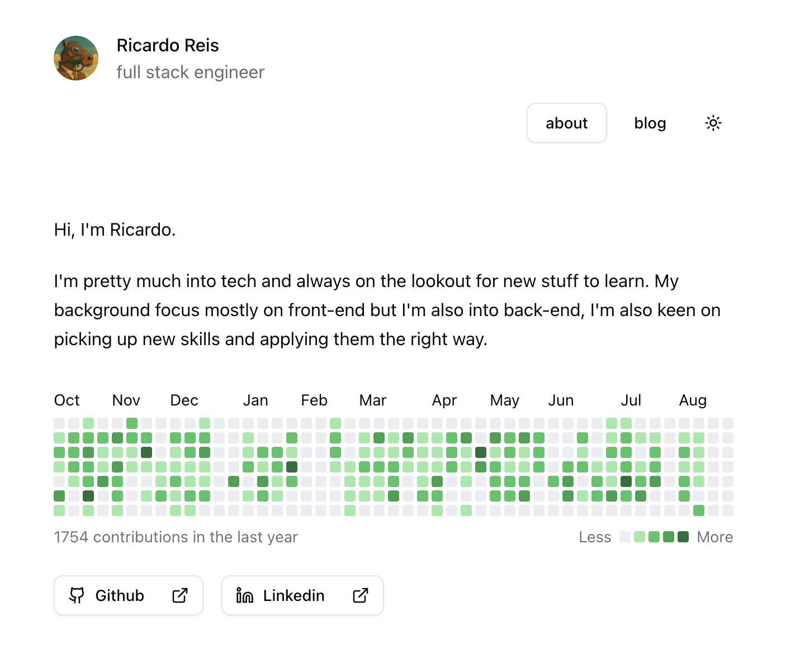

# plckr.dev

My Personal portfolio and blog website built with React / TanStack Start.

Visit [plckr.dev](https://plckr.dev) to see it in action.

<picture>
  <source media="(prefers-color-scheme: dark)" srcset="./dark-site.png">
  
</picture>

## Tech Stack

- **Framework**: [TanStack Start](https://tanstack.com/start) (React SSR)
- **Styling**: [Tailwind CSS v4](https://tailwindcss.com/) + [shadcn/ui](https://ui.shadcn.com/)
- **Content Management**: [Velite](https://velite.vercel.app/) (MDX processing)
- **Tracking**: [PostHog](https://posthog.com/)
- **Deployment**: [Cloudflare Workers](https://workers.cloudflare.com/)

## Project Structure

Most relevant parts of the project.

```
src/
├── components/         # Reusable React components
│   ├── ui/             # ui components
├── lib/
├── routes/             # File-based routing (TanStack Router)
└── styles.css

posts/                  # Blog posts (MDX files)
├── <order-number>.<slug>/
│   └── post.md         # Blog post content
```

## Running the project

### Prerequisites

- Node.js 22
- pnpm package manager

### Installation

Clone the repo and install dependencies with the command below

```bash
pnpm install
```

### Development

```bash
pnpm dev          # Start development server (port 3000)
pnpm velite:watch # Watch for content changes
```

Visit `http://localhost:3000` to see the site.

### Building

```bash
pnpm build        # Build for production
pnpm serve        # Preview production build
```

## Content Management

### Creating Blog Posts

Blog posts are stored in the `posts/` directory as MDX files with frontmatter:

```markdown
---
title: Your Post Title
excerpt: Brief description of your post
date: 2024-01-01
thumbnail: ./images/thumbnail.jpg
---

# Your content here

You can use **Markdown** syntax and even include pre defined React components!
```

### Content Structure

Posts are automatically processed by Velite and made available throughout the application. The system supports:

- Table of contents generation
- Reading time calculation
- Metadata extraction
- MDX component support

## Contributing

1. Fork the repository
2. Create a feature branch (`git checkout -b feature/amazing-feature`)
3. Commit your changes (`git commit -m 'Add amazing feature'`)
4. Push to the branch (`git push origin feature/amazing-feature`)
5. Open a Pull Request

## License

This project is licensed under the MIT License - see the [LICENSE](LICENSE) file for details.

## Advanced Configuration

### Environment Variables

```bash
VITE_PUBLIC_POSTHOG_KEY=your_posthog_key_here
VITE_PUBLIC_POSTHOG_HOST=your_posthog_host_here
```

---

Built with ❤️ using TanStack Start and deployed on Cloudflare Workers.
