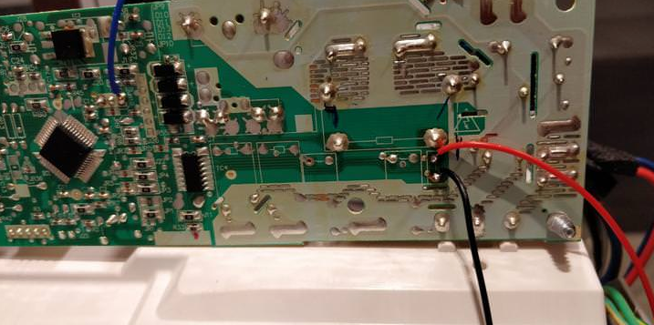

# Material necessário

- [Desumidificador 3](https://www.worten.pt/grandes-eletrodomesticos/climatizacao-e-aquecimento/desumidificadores/desumidificador-becken-10l-bdh2774-5863842) _(ou outro aparelho)_
- Wemos D1 mini _(flashado com [Tasmota](https://tasmota.github.io/docs/))_
- Fios
- Multimetro
- Resistors
- Optoacopladores 4N25
- Material e equipamento para soldar

# Achar a solução

## Usar optos para ler os LEDs e simular toque do botão da placa de controlo

A minha ideia inicial era ler os leds e controlar os botões do painel de controlo. Seriam 6 leds e 2 botões. Utilizando o optoacoplador 4N25, um para cada controlo achava eu que chegava ao que pretendia sem grande dificuldade. A coisa começou a complicar-se quando tentava ligar o opto em paralelo ao LED, o 4N25 precisa de voltagem e acabava por não funcionar nem o led nem o opto.

O botão não tinha dificuldade porque a voltagem era fornecida pelo Wemos e não pelo botão, então ele não perdia voltagem nenhuma.


## Usar LDRs para saber o estado dos LEDs

Depois do desespero tentei implementar um LDR a cada led e saber se está ligado ou não. Como não tenho experiência com LDRs não consegui meter a funcionar, não sei se tinha haver com os pinos do wemos serem digitais e não analógicos.


## Ler o estado diretamente aos componentes

Depois do fracasso dos LDRs, decidi ir diretamente aos componentes e saber o estado deles. Analisando a placa principal na parte de baixo, encontrei a fonte, os 5V para o Wemos, o Switch para o tanque e o relay que controla motor. Ou seja, deste modo, consigo simular o botão a ser pressionado, saber o estado do desumidificador, se ligou ou não e saber o estado do tanque.

O switch tem três pinos na parte de baixo da placa mas só os das pontas é que estão ligados ao switch, ele opera com 5VDC enquanto que o relay opera com 12VDC.


Fiz as ligações. No switch ligo 1 fio que posteriormente dá retorno ao GND da fonte. Quanto ao relay, reparei que se o equipamento estivesse desligado não passava tensão nenhuma, então liguei os dois fios lá. Assim, quando o equipamento ligar o opto vai ligar também.



Depois dos testes estarem OK, passei a cablagem para uma placa. Usei os resistors para diminuir a tensão para que não queime os optos. Não esquecer de aplicar a lei de Ohm para saber que resistor aplicar.


O botão ligado ao opto:


# Wemos com Tasmota

Utilizei [tasmota](https://tasmota.github.io/docs/), assim não tenho que perder tempo a programar.

Para flashar o wemos ver este [link 6](https://github.com/arendst/Sonoff-Tasmota/wiki/Wemos-D1-Mini)

Configurar o módulo para generic e fazer as alterações dos pinos:

O Relay1 é o Botão, Switch2 é o Tanque e o Switch3 é o estado (se está ligado ou desligado).


na consola alterar o pulsetime e o switchmode

```
# Isto faz com que o relay1 passe a OFF imediatamente após ter estado em ON. Aliás, este relay é apenas o clique do botão, não queremos o botão sempre pressionado.
pulsetime1 1

switchmode1 0

switchmode2 2
switchmode3 2
```

alterar as configurações de mqtt a vosso gosto:


# Home Assistant

```yaml
homeassistant:
  customize:
    switch.dehumidifier_power_button:
      friendly_name: 'Ligar/Desligar'
      icon: 'mdi:page-layout-footer'

switch:
  - platform: mqtt
    name: 'dehumidifier_power_button'
    command_topic: 'casa/desumidificador_becken/cmnd/power'
    payload_on: 'ON'
    payload_off: 'ON'
    availability_topic: 'casa/desumidificador_becken/tele/LWT'
    payload_available: 'Online'
    payload_not_available: 'Offline'
    state_topic: 'casa/desumidificador_becken/cmnd/POWER3'
    state_on: 'ON'
    state_off: 'OFF'
    qos: 1
    retain: true

  - platform: mqtt
    name: 'dehumidifier_water_box_switch'
    command_topic: 'casa/desumidificador_becken/cmnd/power2'
    payload_on: 'ON'
    payload_off: 'OFF'
    availability_topic: 'casa/desumidificador_becken/tele/LWT'
    payload_available: 'Online'
    payload_not_available: 'Offline'
    state_topic: 'casa/desumidificador_becken/cmnd/POWER2'
    qos: 1
    retain: true

sensor:
  - platform: template
    sensors:
      dehumidifier_water_box_status:
        friendly_name: 'Estado do Tanque'
        value_template: >
          
            Cheio
          
            OK
          
            Indisponível
          
        icon_template: >
          
            mdi:cup-water
          
            mdi:cup-off
          
            mdi:alert
          
```

A funcionar:


Se estiver desligado:


