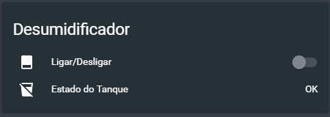

# Introduction

I set out to transform my basic dehumidifier into a smart home device that I could control from my phone and integrate with Home Assistant. This project demonstrates how to turn any simple appliance into a smart device using an ESP8266, optocouplers, and some creative reverse engineering.

The main components I used were a basic dehumidifier (in my case a [Becken](https://www.worten.pt/grandes-eletrodomesticos/climatizacao-e-aquecimento/desumidificadores/desumidificador-becken-10l-bdh2774-5863842)), a Wemos D1 mini, and some basic electronics components including 4N25 optocouplers, resistors, and electrical wires.

# The Challenge

The main challenge was finding a way to interface with the dehumidifier's control board without damaging the original functionality. I needed to:

- Control the power button remotely
- Able to read if dehumidifier is turned on or off
- Read the water tank status (if it's full)
- Integrate everything with a smart system [Home Assistant](https://www.home-assistant.io/)

# Solution Evolution

## Attempt 1: Using Optocouplers for LED Reading and Button Simulation

My initial approach was to read the status LEDs and control the panel buttons directly. I planned to use 6 LEDs and 2 buttons with 4N25 optocouplers for each control point.

However, this approach failed when I tried to connect the optocoupler in parallel with the LED. The 4N25 requires voltage to function, and this setup prevented both the LED and optocoupler from working properly.

The button control worked better since the voltage was supplied by the Wemos rather than the button itself, so there was no voltage loss.


## Attempt 2: Using LDRs to Monitor LED States

After the initial failure, I tried implementing LDRs (Light Dependent Resistors) to detect when each LED was on or off. I used a multimeter to test the LDR connections and verify they were working properly. However, I ran into issues with this approach - likely because the Wemos pins are digital rather than analog, and I lacked experience with LDRs.


## Final Solution: Direct Component State Reading

After the LDR failure, I decided to go directly to the main components and read their states. Using a multimeter to trace the circuit paths, I analyzed the main PCB from the bottom and found:

- Power supply
- 5V source for the Wemos
- Water tank switch
- Relay controlling the motor


This approach allowed me to:

- Simulate button presses
- Know the dehumidifier's power state
- Monitor the water tank status

The switch has three pins on the bottom of the board, but only the outer pins are connected to the actual switch. It operates at 5VDC while the relay operates at 12VDC.


## Making the Connections

I connected one wire to the switch that later returns to the power supply's GND. For the relay, I noticed that when the device was off, no voltage passed through, so I connected both wires there. This way, when the device turns on, the optocoupler activates as well.


After successful testing, I moved the wiring to a custom PCB using soldering equipment. I used resistors to reduce the voltage to prevent burning out the optocouplers. Remember to apply Ohm's law to calculate the correct resistor values.


The button connected to the optocoupler:


# ESP8266 Setup with Tasmota

> **Note**: After using this Tasmota setup for about a year, I migrated to ESPHome for better Home Assistant integration. The next section covers this migration process.

I used [Tasmota](https://tasmota.github.io/docs/) firmware to avoid spending time on custom programming. This open-source firmware provides MQTT connectivity and web interface out of the box.

## Flashing the Wemos D1 Mini

To flash the Wemos, follow this [guide](https://github.com/arendst/Sonoff-Tasmota/wiki/Wemos-D1-Mini).

## Configuration

Configure the module as "Generic" and set up the pins as follows:

- **Relay1**: Power button control
- **Switch2**: Water tank status
- **Switch3**: Device power state (on/off)


## Console Configuration

In the Tasmota console, configure the following settings:

```
# This makes Relay1 turn OFF immediately after being ON. This relay is just for button clicking, not keeping the button pressed.
pulsetime1 1

switchmode1 0

switchmode2 2
switchmode3 2
```

## MQTT Configuration

Configure the MQTT settings according to your setup:


## Home Assistant Integration with Tasmota

Now comes the fun part - integrating everything into Home Assistant! This configuration creates switches and sensors that allow you to control and monitor your dehumidifier from the Home Assistant interface.

Add this configuration to your `configuration.yaml` file:

```yaml
homeassistant:
  customize:
    switch.dehumidifier_power_button:
      friendly_name: 'Power On/Off'
      icon: 'mdi:power'

switch:
  - platform: mqtt
    name: 'dehumidifier_power_button'
    command_topic: 'casa/desumidificador_becken/cmnd/power'
    payload_on: 'ON'
    payload_off: 'ON'
    availability_topic: 'casa/desumidificador_becken/tele/LWT'
    payload_available: 'Online'
    payload_not_available: 'Offline'
    state_topic: 'casa/desumidificador_becken/cmnd/POWER3'
    state_on: 'ON'
    state_off: 'OFF'
    qos: 1
    retain: true

  - platform: mqtt
    name: 'dehumidifier_water_box_switch'
    command_topic: 'casa/desumidificador_becken/cmnd/power2'
    payload_on: 'ON'
    payload_off: 'OFF'
    availability_topic: 'casa/desumidificador_becken/tele/LWT'
    payload_available: 'Online'
    payload_not_available: 'Offline'
    state_topic: 'casa/desumidificador_becken/cmnd/POWER2'
    qos: 1
    retain: true

sensor:
  - platform: template
    sensors:
      dehumidifier_water_box_status:
        friendly_name: 'Water Tank Status'
        value_template: >
          
            Full
          
            OK
          
            Unavailable
          
        icon_template: >
          
            mdi:cup-water
          
            mdi:cup-off
          
            mdi:alert
          
```

# Migration to ESPHome

After using Tasmota for about a year, I decided to migrate to ESPHome. ESPHome is a system to control ESP8266/ESP32 microcontrollers through simple YAML configuration files, and it has better compatibility with Home Assistant compared to Tasmota. Since I already had other devices running ESPHome in my setup, it made sense to standardize everything on the same platform.

The migration was very straightforward. Since it was already using Tasmota, it was only needed to compile the ESPHome binary and upload it via the Tasmota web interface.

## ESPHome Configuration

Here's the ESPHome configuration I used:

```yaml
esphome:
  name: desumidificador
  friendly_name: Desumidificador

esp8266:
  board: d1_mini

# To keep code simple, I ommited code that's specific to each one

switch:
  - platform: template
    id: power
    name: 'dehumidifier_power'
    icon: 'mdi:page-layout-footer'
    lambda: |-
      if (id(running).state) {
        return true;
      } else {
        return false;
      }
    turn_on_action:
      - switch.turn_on: power_gpio
    turn_off_action:
      - switch.turn_on: power_gpio

  - platform: gpio
    id: power_gpio
    pin:
      number: D1
      mode: INPUT_PULLUP
      inverted: true
    restore_mode: ALWAYS_OFF
    on_turn_on:
      - delay: 1s
      - switch.turn_off: power_gpio

binary_sensor:
  - platform: gpio
    name: 'dehumidifier_tank_full'
    id: tank_full
    pin:
      number: D2
      mode: INPUT_PULLUP
      inverted: true
  - platform: gpio
    name: 'dehumidifier_tank_inserted'
    id: tank_inserted
    pin:
      number: D5
      mode: INPUT_PULLUP
      inverted: True
  - platform: gpio
    name: 'dehumidifier_running'
    id: running
    pin:
      number: D3
      mode: INPUT_PULLUP
      inverted: True

text_sensor:
  - platform: template
    name: 'dehumidifier_tank_state'
    icon: 'mdi:cup-water'
    update_interval: 5s
    lambda: |-
      if (id(tank_full).state && id(tank_inserted).state) {
        return {"Cheio"};
      } else if (id(tank_full).state && !id(tank_inserted).state) {
        return {"Sem Tanque"};
      } else if (!id(tank_full).state && id(tank_inserted).state) {
        return {"OK"};
      } else {
        return {"unavailable"};
      }
```

## Results

Here's the final result in action:




When the device is offline:


# Conclusion

This project demonstrates how you can transform a basic appliance into a smart home device with basic electronics knowledge. The key is to understand the device's internal circuitry and finding the right points to interface with it.
