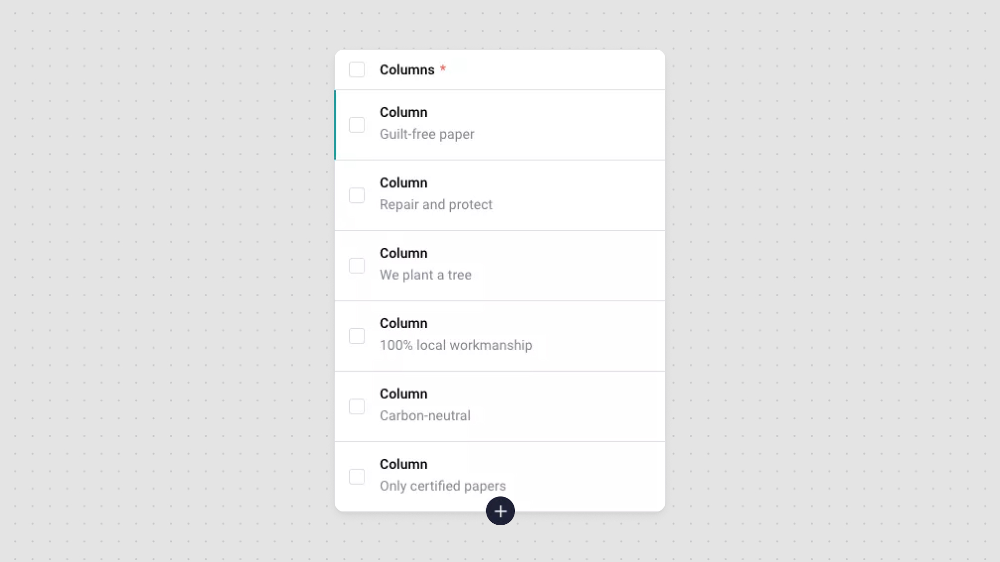
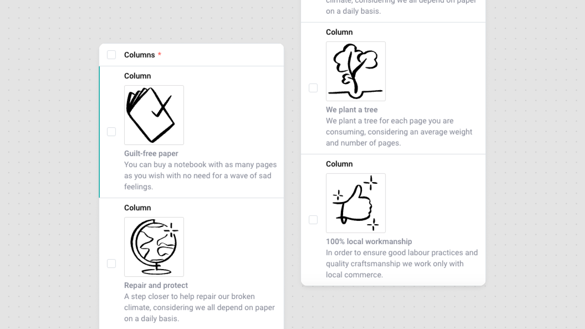

# Introduction

The good organization of the content in the Storyblok is good for the client and for the project manager, to provide them with a good experience and to avoid possible issues, I made a list so that we can deliver a cleaner and more organized CMS.

# Block preview

In order to maintain a good presentation, and for better access, a good preview makes it much easier for the user.

Imagining that we create a block with

- Image
- Title
- Description

By default, Storyblok will only display the Title in the block’s preview, so what if we could make all the information available in that block in advance? It would be great, and it’s even possible!

By default:



With the following code:



Block Edit → Config


```
{{image(options.icon.filename)/}}
<div class="field-type-bloks__title">{{title}}</div>
<div>{{description}}</div>
```

## Styling

To help with styling, we can use some classes previously injected into Storyblok's CSS to make it easier to read.

Here are some class examples:

| Class                         | Purpose                    |
| ----------------------------- | -------------------------- |
| field-type-bloks\_\_title     | Makes the text bold        |
| field-type-bloks\_\_sub-title | Make the text look thinner |

Here’s the whole css file provided from Storyblok: [https://app.storyblok.com/css/index-latest.css](https://app.storyblok.com/css/index-latest.css)

## Display images

```
// {{image(options.<your_attribute>.filename)/}}
{{image(options.image.filename)/}}
```

## Documentation

Preview templates uses Squirrelly, you can check both their docs and the Storyblok’s dedicated page to this subject.

[https://www.storyblok.com/docs/schema-configuration](https://www.storyblok.com/docs/schema-configuration)

[https://squirrelly.js.org/](https://squirrelly.js.org/)

# Create unique sub-blocks

Please, avoid the reuse of sub-blocks as much as possible. At first it may be advantageous to reuse, but in my experience, most of the time it turns out not to be.

> In this context, sub-blocks represent blocks that are included in an array of another block.

For example, a sub-block with the simple purpose of having a title and description can create doubts about whether to reuse, not reuse. Because although the content of the block does not change in the future, we may need to put the description as “not required” or “not translatable”, or even limit the number of characters in the description of a certain block only. Therefore, do not reuse.

However, some sub-blocks may make sense to reuse, such as a block destined to “Link”, which is normally used by the entire CMS and always has the same
objective.

# Rename sub-block title

If you follow the previous approach, you will end up with blocks with names like this

`<block-section>-<sub-block>`→`partners-section-logo`

By default, the title of your sub-block will be **Partners Section Logo**, although this is not incorrect, it has duplicate information from your parent block, to avoid this I recommend changing the name to just **Logo**


# Editable sub-blocks

In order for the client to be able to interact with the blocks, even with the sub-blocks, it is important not to forget to pass the necessary props from `StoryblokEditable`.


Every single Store is clickable

It is very common to use props in the section block (primary), but the experience is much better if you add them to the sub-blocks.

Imagine a block with more than 50 sub-blocks, and sometimes it is difficult to find it in the list, if we add this functionality, it makes everything simpler.


# Assets

I don't have the perfect formula, and there may even be better solutions. However, my recommendation goes something like this.

On the first level, I arrange folders by type of file/content.

For example:

- Icons
- Images
- Files (documents)
- SEO Images

Within these folders, if necessary, we can create subfolders to separate the contents better.

Usually, there is more need in the images folder, which is where there will be more assets.


Later, if we have a block that will fetch only a certain type of content, we must say that the **Default assets folder** is the folder in question to make it more obvious for the client to place new assets there.


# Conclusion

In conclusion, by implementing these practices, we are able to distribute a clean, organized and easy-to-maintain CMS. We also guarantee greater satisfaction on the content editor team, providing more quality, professionalism and security.
